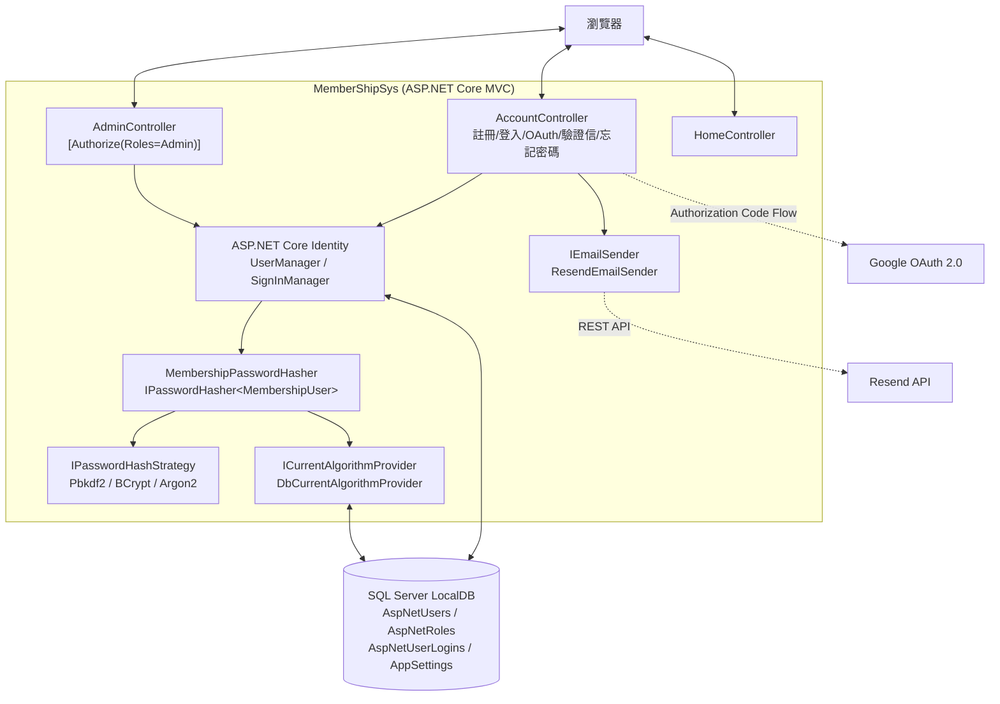
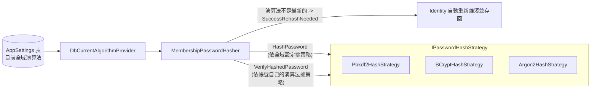
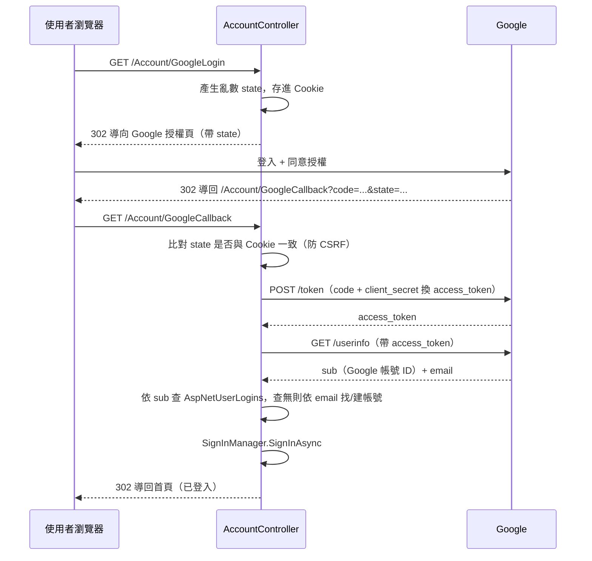
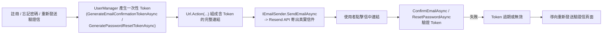

# MemberShipSys

一個練習用的 ASP.NET Core MVC 會員系統，目的是動手刻密碼雜湊、OAuth、Email 驗證這些「底層邏輯」，而不是只呼叫框架內建的現成方法。

## 目錄

- [功能特色](#功能特色)
- [技術棧](#技術棧)
- [整體架構](#整體架構)
- [密碼雜湊策略](#密碼雜湊策略可插拔--全域切換--自動遷移)
- [Google OAuth 登入流程](#google-oauth-登入流程)
- [Email 驗證 / 忘記密碼流程](#email-驗證--忘記密碼流程)
- [快速開始](#快速開始)
- [外部服務設定備忘](#外部服務設定備忘)
- [專案結構](#專案結構)
- [測試](#測試)

## 功能特色

- **可插拔密碼雜湊**：PBKDF2 / BCrypt / Argon2 三選一，Admin 後台可即時切換全域演算法，登入時自動把舊演算法的帳號遷移成新演算法（`PasswordVerificationResult.SuccessRehashNeeded`）
- **Google OAuth 登入**：手刻 Authorization Code Flow（不是用 `AddGoogle()`），帳號以 Email 自動關聯本地帳號，OAuth-only 帳號可事後補設本地密碼
- **帳號安全機制**：3 次登入失敗鎖定 15 分鐘、Admin 可手動解鎖、強制登出（撤銷 SecurityStamp）、Admin 主動停用帳號（與系統鎖定分開的獨立狀態）
- **Email 驗證 / 忘記密碼**：透過 [Resend](https://resend.com) 寄送真實信件，驗證連結過期時提供重新發送機制，全程遵守「不洩漏帳號是否存在」原則
- **Admin 後台**：會員列表（角色/狀態/鎖定/演算法一覽）、停用啟用、變更角色（防止自我降級）、強制登出、全域演算法設定

## 技術棧

- ASP.NET Core MVC（.NET 10）
- ASP.NET Core Identity + Entity Framework Core
- SQL Server LocalDB
- Bootstrap 5（自訂主題）
- [Resend](https://resend.com) REST API（透過 `IHttpClientFactory` 直接呼叫，未使用官方 SDK）

## 整體架構



## 密碼雜湊策略（可插拔 + 全域切換 + 自動遷移）



每個帳號的 `CurrentHashAlgorithm` 欄位記錄「這個帳號的密碼是用哪個演算法雜湊的」，跟「目前全域生效的演算法」是兩件事——這正是「登入時自動遷移」的關鍵：驗證用帳號自己的演算法，遷移則看全域設定。

## Google OAuth 登入流程



## Email 驗證 / 忘記密碼流程

註冊確認信、忘記密碼信走的是同一套模式：



寄信失敗（Resend API 出錯）會被 `try/catch` 接住，不會讓使用者看到系統錯誤頁；忘記密碼/重新發送驗證信的表單，不論帳號存不存在都顯示同一句話，避免被用來探測系統裡有哪些帳號。

## 快速開始

### 必要條件

- .NET 10 SDK
- SQL Server LocalDB（隨 Visual Studio 安裝，Windows 限定）
- 一組 Google Cloud OAuth 用戶端（Client ID / Secret）
- 一組 [Resend](https://resend.com) 帳號 + 已驗證的網域

### 1. 還原套件並建立資料庫

```bash
cd MemberShipSys
dotnet restore
dotnet ef database update
```

### 2. 設定 User Secrets（必要，沒設定啟動會失敗或功能無法使用）

```bash
dotnet user-secrets init
dotnet user-secrets set "AdminSeed:Email" "admin@example.com"
dotnet user-secrets set "AdminSeed:Password" "一組符合密碼原則的密碼"
dotnet user-secrets set "GoogleOAuth:ClientId" "你的 Google OAuth Client ID"
dotnet user-secrets set "GoogleOAuth:ClientSecret" "你的 Google OAuth Client Secret"
dotnet user-secrets set "Resend:ApiKey" "你的 Resend API Key"
dotnet user-secrets set "Resend:FromAddress" "noreply@你驗證過的網域.com"
```

> 密碼原則預設要求：大寫 + 小寫 + 數字 + 符號、長度 ≥ 6。`AdminSeed:Password` 沒符合的話，第一次啟動的種子邏輯會直接丟例外並顯示原因。

### 3. 執行

```bash
dotnet run --launch-profile https
```

啟動時會自動：建立 `Admin`/`Member` 角色、種一個 Admin 帳號、種一筆全域雜湊演算法設定（預設 Argon2）。

## 外部服務設定備忘

### Google Cloud Console

- 「OAuth 同意畫面」User Type 選「外部」，開發階段維持「測試中」即可，但要把自己的 Google 帳號加進「測試使用者」名單，不然登入會被拒絕
- 「已授權的重新導向 URI」要設成 `https://localhost:7292/Account/GoogleCallback`（對應 `Properties/launchSettings.json` 裡 `https` profile 的 port；改了 port 記得同步更新這裡）
- Client ID/Secret 存進 user-secrets 的 `GoogleOAuth:ClientId` / `GoogleOAuth:ClientSecret`，絕對不要寫進 `appsettings.json`

### Resend

- ⚠️ **`onboarding@resend.com` 不是免設定就能用的測試寄件位址**——不管收件人是誰，用這個位址寄信一律會收到 `403 domain not verified`。**一定要先在 [resend.com/domains](https://resend.com/domains) 驗證自己的網域**（加 DNS 記錄、等生效），`Resend:FromAddress` 才能設成該網域下的信箱（例如 `noreply@你的網域.com`）
- 網域驗證完成前，可以直接用 `curl` 打 Resend API 本身來快速確認網域狀態，不用透過整個應用程式：
  ```bash
  curl -i -X POST https://api.resend.com/emails \
    -H "Authorization: Bearer <API_KEY>" \
    -H "Content-Type: application/json" \
    -d '{"from":"noreply@你的網域.com","to":["你的信箱"],"subject":"test","html":"<p>test</p>"}'
  ```
  回傳 `200` 且帶 email id 才代表真的能寄信。

### 資料庫

- 開發環境用 SQL Server LocalDB（`(localdb)\mssqllocaldb`），連線字串在 `appsettings.json`，不含帳密（Windows 整合驗證）
- 換到正式環境的 SQL Server 時，連線字串要透過環境變數或 `appsettings.Production.json` 覆蓋，不要直接改 `appsettings.json`

## 專案結構

```
MemberShipSys/
├── Controllers/
│   ├── AccountController.cs   # 註冊/登入/登出/OAuth/Email驗證/忘記密碼/設定密碼
│   ├── AdminController.cs     # 會員管理後台（僅 Admin）
│   └── HomeController.cs
├── Data/
│   └── ApplicationDbContext.cs
├── Models/                    # ViewModel + MembershipUser + AppSetting + enum
├── Services/
│   ├── IPasswordHashStrategy.cs / Hashing/*.cs   # 三種雜湊策略 + 組合器
│   ├── ICurrentAlgorithmProvider.cs / DbCurrentAlgorithmProvider.cs
│   └── IEmailSender.cs / ResendEmailSender.cs
├── Views/
│   ├── Account/                # 卡片式表單（登入/註冊/忘記密碼等）
│   ├── Admin/                  # 會員管理 Dashboard
│   └── Shared/_Layout.cshtml   # 導覽列 + 通用 StatusMessage 訊息橫幅
├── Migrations/
└── wwwroot/css/site.css        # 自訂設計系統（配色/卡片/徽章/RWD）

MemberShipSys.Tests/            # 三種雜湊策略的單元測試
```

## 測試

```bash
cd MemberShipSys.Tests
dotnet test
```

目前只針對密碼雜湊策略（`Pbkdf2HashStrategy` / `BCryptHashStrategy` / `Argon2HashStrategy`）寫單元測試，Controller/View 沒有寫測試，靠手動 + `curl` 端對端驗證。
